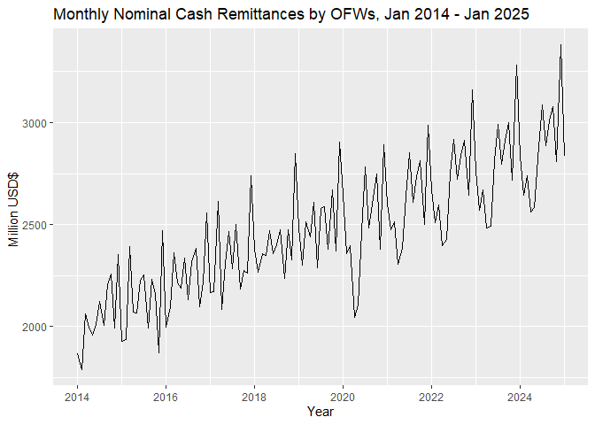
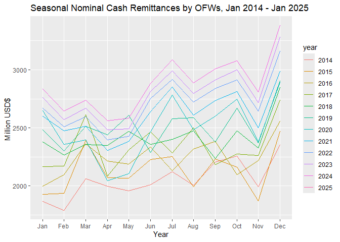
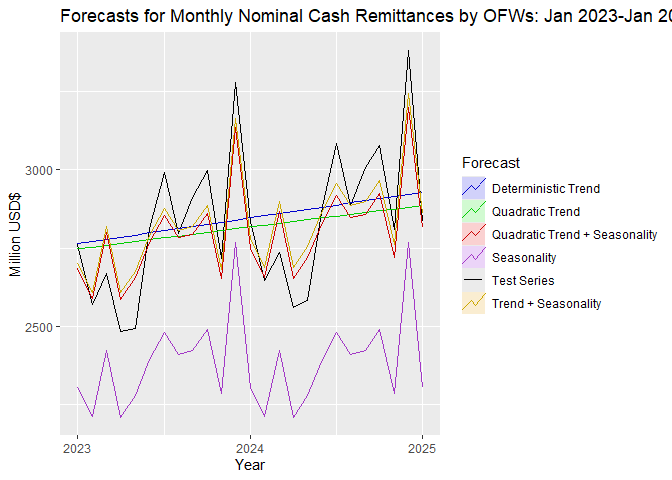
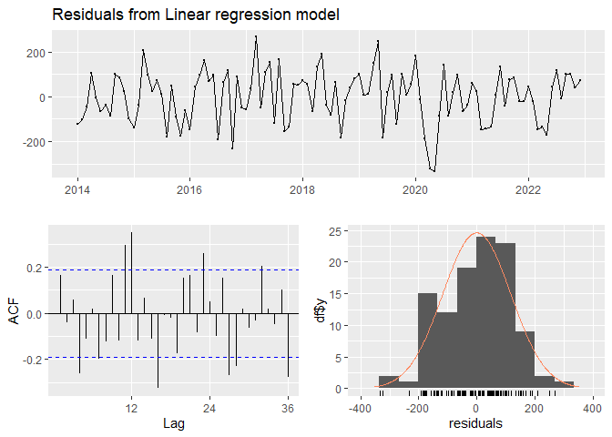

Remittance Q1 Forecasting
================
Car3lo
2025-05-18

# Forecasting Q1 2025 PH Remiittances

### Load libraries and Datasets

``` r
library(fpp2)
```

    ## Warning: package 'fpp2' was built under R version 4.3.3

    ## Registered S3 method overwritten by 'quantmod':
    ##   method            from
    ##   as.zoo.data.frame zoo

    ## ── Attaching packages ────────────────────────────────────────────── fpp2 2.5 ──

    ## ✔ ggplot2   3.5.1      ✔ fma       2.5   
    ## ✔ forecast  8.23.0     ✔ expsmooth 2.3

    ## Warning: package 'ggplot2' was built under R version 4.3.3

    ## Warning: package 'forecast' was built under R version 4.3.3

    ## Warning: package 'fma' was built under R version 4.3.3

    ## Warning: package 'expsmooth' was built under R version 4.3.3

    ## 

``` r
library(seastests)
```

    ## Warning: package 'seastests' was built under R version 4.3.3

``` r
setwd("D:/New Documents/UPSE_4-2/portfolio_temp/[132] Remittance and Inflation Forecasts/Remittance")
OFremit <- read.csv("remittance_ph.csv")
```

### Creating Time Series Objects

``` r
OFremit.ts <- ts(OFremit, frequency = 12, start = c(2013,1))
OFremit2.ts <- window(OFremit.ts, start = c(2014,1))
```

### Plotting and testing for seasonality

``` r
autoplot(OFremit2.ts[,2])+
  ggtitle("Monthly Nominal Cash Remittances by OFWs, Jan 2014 - Jan 2025")+
  xlab("Year")+
  ylab("Million USD$ ")
```

<!-- -->

``` r
ggseasonplot(OFremit2.ts[,2])+
  ggtitle("Seasonal Nominal Cash Remittances by OFWs, Jan 2014 - Jan 2025")+
  xlab("Year")+
  ylab("Million USD$ ")
```

<!-- -->

In terms of trend, there is consistent upward direction from 2014 to
2025. This could be caused by many reasons such as increasing number of
OFWs over the years or increased wages of OFWs. In 2020, the trend had a
dip because of the Global Pandemic Event.

In terms of seasonality, there are some seasonal peaks every year in
July and December (sometimes October). This could be because July is
when school starts and OFWs’ families need to pay for tuition. The
holiday effect of December could be the reason that fuels the spike of
remittances in December.

### Test for Seasonality

- HO: There is no seasonality in the time series data
- HA: There is seasonality in the time series data

``` r
help(kw)
```

    ## starting httpd help server ... done

``` r
kw(OFremit2.ts[,2], freq = 12, diff = TRUE, residuals = FALSE, autoarima = FALSE)
```

    ## Test used:  Kruskall Wallis 
    ##  
    ## Test statistic:  86.01 
    ## P-value:  1.002531e-13

### Getting Test and Training Sets

``` r
OFremit2.train <- window(OFremit2.ts, end = c(2022,12))
OFremit2.test <- window(OFremit2.ts, start = c(2023,1))
```

### Modelling Trend and Seasonality

``` r
help(AIC)
obs <- nrow(data.frame(OFremit2.train))
# deterministic trend
OFremit2_trend <- tslm(remittance ~ trend, data = OFremit2.train)
summary(OFremit2_trend)
```

    ## 
    ## Call:
    ## tslm(formula = remittance ~ trend, data = OFremit2.train)
    ## 
    ## Residuals:
    ##     Min      1Q  Median      3Q     Max 
    ## -491.84 -108.32  -14.25  107.93  421.19 
    ## 
    ## Coefficients:
    ##              Estimate Std. Error t value Pr(>|t|)    
    ## (Intercept) 2015.8303    34.6412   58.19   <2e-16 ***
    ## trend          6.8674     0.5517   12.45   <2e-16 ***
    ## ---
    ## Signif. codes:  0 '***' 0.001 '**' 0.01 '*' 0.05 '.' 0.1 ' ' 1
    ## 
    ## Residual standard error: 178.8 on 106 degrees of freedom
    ## Multiple R-squared:  0.5938, Adjusted R-squared:  0.5899 
    ## F-statistic: 154.9 on 1 and 106 DF,  p-value: < 2.2e-16

``` r
AIC(OFremit2_trend)
```

    ## [1] 1430.648

``` r
AIC(OFremit2_trend, k = log(obs))
```

    ## [1] 1438.695

``` r
# quadratic trend
OFremit2_qtrend <- tslm(remittance ~ poly(trend,2), data = OFremit2.train)
summary(OFremit2_qtrend)
```

    ## 
    ## Call:
    ## tslm(formula = remittance ~ poly(trend, 2), data = OFremit2.train)
    ## 
    ## Residuals:
    ##     Min      1Q  Median      3Q     Max 
    ## -496.09 -114.29  -18.26  110.83  417.39 
    ## 
    ## Coefficients:
    ##                 Estimate Std. Error t value Pr(>|t|)    
    ## (Intercept)      2390.10      17.27  138.41   <2e-16 ***
    ## poly(trend, 2)1  2224.94     179.45   12.40   <2e-16 ***
    ## poly(trend, 2)2   -75.33     179.45   -0.42    0.676    
    ## ---
    ## Signif. codes:  0 '***' 0.001 '**' 0.01 '*' 0.05 '.' 0.1 ' ' 1
    ## 
    ## Residual standard error: 179.5 on 105 degrees of freedom
    ## Multiple R-squared:  0.5944, Adjusted R-squared:  0.5867 
    ## F-statistic: 76.95 on 2 and 105 DF,  p-value: < 2.2e-16

``` r
AIC(OFremit2_qtrend)
```

    ## [1] 1432.467

``` r
AIC(OFremit2_qtrend, k = log(obs))
```

    ## [1] 1443.196

``` r
# seasonality
OFremit2_season <- tslm(remittance ~ season, data = OFremit2.train)
summary(OFremit2_season)
```

    ## 
    ## Call:
    ## tslm(formula = remittance ~ season, data = OFremit2.train)
    ## 
    ## Residuals:
    ##     Min      1Q  Median      3Q     Max 
    ## -439.07 -190.83   16.22  179.63  436.69 
    ## 
    ## Coefficients:
    ##             Estimate Std. Error t value Pr(>|t|)    
    ## (Intercept)  2304.46      83.43  27.623  < 2e-16 ***
    ## season2       -92.88     117.98  -0.787  0.43309    
    ## season3       119.20     117.98   1.010  0.31489    
    ## season4       -93.57     117.98  -0.793  0.42969    
    ## season5       -24.80     117.98  -0.210  0.83397    
    ## season6        88.97     117.98   0.754  0.45262    
    ## season7       176.17     117.98   1.493  0.13867    
    ## season8       106.47     117.98   0.902  0.36910    
    ## season9       118.08     117.98   1.001  0.31943    
    ## season10      185.67     117.98   1.574  0.11884    
    ## season11      -19.23     117.98  -0.163  0.87084    
    ## season12      463.64     117.98   3.930  0.00016 ***
    ## ---
    ## Signif. codes:  0 '***' 0.001 '**' 0.01 '*' 0.05 '.' 0.1 ' ' 1
    ## 
    ## Residual standard error: 250.3 on 96 degrees of freedom
    ## Multiple R-squared:  0.2787, Adjusted R-squared:  0.1961 
    ## F-statistic: 3.373 on 11 and 96 DF,  p-value: 0.0005704

``` r
AIC(OFremit2_season)
```

    ## [1] 1512.646

``` r
AIC(OFremit2_season, k = log(obs))
```

    ## [1] 1547.514

``` r
# trend+seasonality
OFremit2_trendseason <- tslm(remittance ~ trend + season, data = OFremit2.train)
summary(OFremit2_trendseason)
```

    ## 
    ## Call:
    ## tslm(formula = remittance ~ trend + season, data = OFremit2.train)
    ## 
    ## Residuals:
    ##     Min      1Q  Median      3Q     Max 
    ## -332.79  -86.47   15.58   86.70  270.94 
    ## 
    ## Coefficients:
    ##              Estimate Std. Error t value Pr(>|t|)    
    ## (Intercept) 1980.3002    45.6706  43.361  < 2e-16 ***
    ## trend          6.6155     0.3871  17.091  < 2e-16 ***
    ## season2      -99.4931    58.7560  -1.693   0.0937 .  
    ## season3      105.9672    58.7598   1.803   0.0745 .  
    ## season4     -113.4154    58.7662  -1.930   0.0566 .  
    ## season5      -51.2597    58.7751  -0.872   0.3853    
    ## season6       55.8959    58.7865   0.951   0.3441    
    ## season7      136.4731    58.8006   2.321   0.0224 *  
    ## season8       60.1595    58.8171   1.023   0.3090    
    ## season9       65.1553    58.8362   1.107   0.2709    
    ## season10     126.1315    58.8579   2.143   0.0347 *  
    ## season11     -85.3902    58.8820  -1.450   0.1503    
    ## season12     390.8648    58.9088   6.635 1.98e-09 ***
    ## ---
    ## Signif. codes:  0 '***' 0.001 '**' 0.01 '*' 0.05 '.' 0.1 ' ' 1
    ## 
    ## Residual standard error: 124.6 on 95 degrees of freedom
    ## Multiple R-squared:  0.823,  Adjusted R-squared:  0.8006 
    ## F-statistic: 36.81 on 12 and 95 DF,  p-value: < 2.2e-16

``` r
AIC(OFremit2_trendseason)
```

    ## [1] 1362.928

``` r
AIC(OFremit2_trendseason, k = log(obs))
```

    ## [1] 1400.478

``` r
# quadratic trend+seasonality
OFremit2_qtrendseason <- tslm(remittance ~ poly(trend,2) + season, data = OFremit2.train)
summary(OFremit2_qtrendseason)
```

    ## 
    ## Call:
    ## tslm(formula = remittance ~ poly(trend, 2) + season, data = OFremit2.train)
    ## 
    ## Residuals:
    ##     Min      1Q  Median      3Q     Max 
    ## -336.77  -87.64   13.34   90.26  264.54 
    ## 
    ## Coefficients:
    ##                 Estimate Std. Error t value Pr(>|t|)    
    ## (Intercept)      2341.01      41.73  56.094  < 2e-16 ***
    ## poly(trend, 2)1  2143.34     125.81  17.037  < 2e-16 ***
    ## poly(trend, 2)2   -78.97     125.04  -0.632   0.5292    
    ## season2           -99.58      58.94  -1.689   0.0944 .  
    ## season3           105.81      58.95   1.795   0.0759 .  
    ## season4          -113.63      58.95  -1.927   0.0570 .  
    ## season5           -51.50      58.96  -0.874   0.3846    
    ## season6            55.63      58.97   0.943   0.3479    
    ## season7           136.21      58.99   2.309   0.0231 *  
    ## season8            59.91      59.01   1.015   0.3125    
    ## season9            64.95      59.02   1.100   0.2740    
    ## season10          125.97      59.05   2.134   0.0355 *  
    ## season11          -85.48      59.07  -1.447   0.1512    
    ## season12          390.86      59.10   6.614 2.26e-09 ***
    ## ---
    ## Signif. codes:  0 '***' 0.001 '**' 0.01 '*' 0.05 '.' 0.1 ' ' 1
    ## 
    ## Residual standard error: 125 on 94 degrees of freedom
    ## Multiple R-squared:  0.8237, Adjusted R-squared:  0.7994 
    ## F-statistic: 33.79 on 13 and 94 DF,  p-value: < 2.2e-16

``` r
AIC(OFremit2_qtrendseason)
```

    ## [1] 1364.47

``` r
AIC(OFremit2_qtrendseason, k = log(obs))
```

    ## [1] 1404.702

<figure>

<figcaption aria-hidden="true">Model Table Summary</figcaption>
</figure>

The inclusion of the trend on both the Deterministic (Linear) Trend and
Trend + Seasonality Trend models are justifiable since the raw trend
components have a statistically significant intercept.Both Models
explain ~58% of the variation of remittance in the data.

The first orthogonal trend component (Trend1) of both quadratic models
are highlight significant.The second orthogonal Trend Component (trend2)
is not significant however, but can probably say that Trend1 captures
most of the non-linear trend in the data.

It would make sense to include Seasonal Dummies. As seasons 7 (July), 10
(October) and 12 (December) are significant at P \< 0.10 and 0.01
respectively. These months deviate from the overall trend so it is
important to capture them. The models with lowest AIC/BIC are the ones
that include trend and seasonality. Which further supports accounting
for the trend and seasonality when creating a linear model to fit the
training data best.

### Forecasting

``` r
print(nrow(data.frame(OFremit2.test))) #25
```

    ## [1] 25

``` r
OFremit2_trendf <- forecast(OFremit2_trend, h=25)
OFremit2_qtrendf <- forecast(OFremit2_qtrend, h=25)
OFremit2_seasonf <- forecast(OFremit2_season, h=25)
OFremit2_trendseasonf <- forecast(OFremit2_trendseason, h=25)
OFremit2_qtrendseasonf <- forecast(OFremit2_qtrendseason, h=25)
```

### Plotting

``` r
autoplot(OFremit2.test[,2], series = "Test Series") +
  autolayer(OFremit2_trendf, series = "Deterministic Trend", PI = FALSE) +
  autolayer(OFremit2_qtrendf, series = "Quadratic Trend", PI = FALSE) +
  autolayer(OFremit2_seasonf, series = "Seasonality", PI = FALSE) +
  autolayer(OFremit2_trendseasonf, series = "Trend + Seasonality", PI = FALSE) +
  autolayer(OFremit2_qtrendseasonf, series = "Quadratic Trend + Seasonality", PI = FALSE) +
  xlab("Year") +
  ylab("Million USD$") +
  ggtitle("Forecasts for Monthly Nominal Cash Remittances by OFWs: Jan 2023-Jan 2025") +
  scale_color_manual(values = c("Test Series" = "black",
                                "Deterministic Trend" = "blue",   
                                "Quadratic Trend" = "darkgreen",
                                "Seasonality" = "purple",
                                "Trend + Seasonality" = "orange",
                                "Quadratic Trend + Seasonality" = "red")) +
  guides(color = guide_legend(title = "Forecast"))
```

<!-- -->

The best models should be orange and red (trend + seasonality). And from
the plot it does seem like it.

### Comparing Accuracy

``` r
accuracy(OFremit2_trendf, OFremit2.test[,2])[,c("RMSE","MAE","MAPE")] # Trend
```

    ##                  RMSE      MAE     MAPE
    ## Training set 177.0894 140.7189 5.894474
    ## Test set     205.5614 161.0288 5.688437

``` r
accuracy(OFremit2_qtrendf, OFremit2.test[,2])[,c("RMSE","MAE","MAPE")] # Quadratic Trend
```

    ##                  RMSE      MAE     MAPE
    ## Training set 176.9410 140.4789 5.879891
    ## Test set     207.9437 162.0428 5.664371

``` r
accuracy(OFremit2_seasonf, OFremit2.test[,2])[,c("RMSE","MAE","MAPE")] # Seasonality
```

    ##                  RMSE      MAE      MAPE
    ## Training set 235.9645 200.2264  8.553466
    ## Test set     459.8796 446.0998 15.583159

``` r
accuracy(OFremit2_trendseasonf, OFremit2.test[,2])[,c("RMSE","MAE","MAPE")] # Trend + Seasonality
```

    ##                  RMSE      MAE     MAPE
    ## Training set 116.8957 95.98253 4.116961
    ## Test set     102.8085 87.48420 3.114922

``` r
accuracy(OFremit2_qtrendseasonf, OFremit2.test[,2])[,c("RMSE","MAE","MAPE")] # Quadratic  + Seasonality
```

    ##                  RMSE      MAE     MAPE
    ## Training set 116.6485 95.32560 4.083957
    ## Test set     111.0450 98.05898 3.429687

The best model with the overall lower RMSE, MAE, MAPE would be the
Trend + Seasonality. Quadratic Trend + Seasonality would also come
close. From (AIC/BIC) and eye-test at the plots, orange or Trend +
Seasonality seems to fit the Test Series best indeed.

### Residual Diagnostics

``` r
checkresiduals(OFremit2_trendseasonf)
```

<!-- -->

    ## 
    ##  Ljung-Box test
    ## 
    ## data:  Residuals from Linear regression model
    ## Q* = 79.499, df = 22, p-value = 1.959e-08
    ## 
    ## Model df: 0.   Total lags used: 22

``` r
Box.test(residuals(OFremit2_trendseasonf), lag=4, fitdf=0, type="Ljung-Box")
```

    ## 
    ##  Box-Ljung test
    ## 
    ## data:  residuals(OFremit2_trendseasonf)
    ## X-squared = 11.45, df = 4, p-value = 0.02195

``` r
#H0: white noise/autocorrelation is not significantly different from zero.
```

Going from eye-tests and from the Residuals, the variation looks like it
definitely changed ever since the pandemic hit. In the ACF, many lines
exceed the threshold for white noise as well. Furthermore, from the
Ljung-Box test, the p-value is 0.02 which means we reject the HO that
the residuals exihibit white noise characetristics.

### Forecasting Q1 2025

``` r
OFremit2_trendseasonf_new <- forecast(OFremit2_trendseason, h=27)
OFremit2_trendseasonf_new #2835.905 2767.288 2979.364
```

    ##          Point Forecast    Lo 80    Hi 80    Lo 95    Hi 95
    ## Jan 2023       2701.393 2529.215 2873.570 2436.528 2966.258
    ## Feb 2023       2608.515 2436.338 2780.693 2343.650 2873.381
    ## Mar 2023       2820.591 2648.414 2992.769 2555.726 3085.456
    ## Apr 2023       2607.824 2435.647 2780.002 2342.959 2872.689
    ## May 2023       2676.595 2504.418 2848.773 2411.730 2941.461
    ## Jun 2023       2790.366 2618.189 2962.544 2525.501 3055.232
    ## Jul 2023       2877.559 2705.382 3049.737 2612.694 3142.424
    ## Aug 2023       2807.861 2635.684 2980.039 2542.996 3072.726
    ## Sep 2023       2819.473 2647.295 2991.650 2554.607 3084.338
    ## Oct 2023       2887.064 2714.887 3059.242 2622.199 3151.929
    ## Nov 2023       2682.158 2509.981 2854.336 2417.293 2947.023
    ## Dec 2023       3165.029 2992.851 3337.206 2900.163 3429.894
    ## Jan 2024       2780.779 2607.458 2954.101 2514.154 3047.404
    ## Feb 2024       2687.902 2514.580 2861.223 2421.277 2954.527
    ## Mar 2024       2899.978 2726.656 3073.299 2633.352 3166.603
    ## Apr 2024       2687.211 2513.889 2860.532 2420.585 2953.836
    ## May 2024       2755.982 2582.660 2929.303 2489.357 3022.607
    ## Jun 2024       2869.753 2696.431 3043.074 2603.128 3136.378
    ## Jul 2024       2956.946 2783.624 3130.267 2690.321 3223.571
    ## Aug 2024       2887.248 2713.926 3060.569 2620.622 3153.873
    ## Sep 2024       2898.859 2725.537 3072.180 2632.234 3165.484
    ## Oct 2024       2966.451 2793.129 3139.772 2699.825 3233.076
    ## Nov 2024       2761.544 2588.223 2934.866 2494.919 3028.170
    ## Dec 2024       3244.415 3071.093 3417.737 2977.790 3511.040
    ## Jan 2025       2860.166 2685.502 3034.830 2591.476 3128.856
    ## Feb 2025       2767.288 2592.624 2941.952 2498.598 3035.978
    ## Mar 2025       2979.364 2804.700 3154.028 2710.674 3248.054

``` r
OFremit2.test #2835.90 2645.557 2737.834 
```

    ##          month_year remittance pesoperdollar cpi_2018
    ## Jan 2023        125   2761.930       54.9913    121.4
    ## Feb 2023        124   2569.345       54.7831    121.4
    ## Mar 2023        128   2670.972       54.7956    121.1
    ## Apr 2023        121   2484.793       55.3155    120.9
    ## May 2023        129   2493.803       55.7279    120.9
    ## Jun 2023        127   2812.471       55.8946    121.1
    ## Jul 2023        126   2991.816       54.9211    121.2
    ## Aug 2023        122   2795.825       56.1599    122.5
    ## Sep 2023        132   2912.882       56.7869    123.9
    ## Oct 2023        131   2997.925       56.7889    123.7
    ## Nov 2023        130   2718.835       55.8122    123.9
    ## Dec 2023        123   3280.333       55.5877    124.1
    ## Jan 2024        137   2835.905       55.9723    124.8
    ## Feb 2024        136   2645.557       56.0649    125.5
    ## Mar 2024        140   2737.834       55.8493    125.6
    ## Apr 2024        133   2562.307       56.9506    125.5
    ## May 2024        141   2583.469       57.7619    125.6
    ## Jun 2024        139   2881.751       58.6963    125.6
    ## Jul 2024        138   3084.757       58.4845    126.5
    ## Aug 2024        134   2885.405       57.1935    126.6
    ## Sep 2024        144   3008.765       56.0713    126.3
    ## Oct 2024        143   3078.713       57.3009    126.5
    ## Nov 2024        142   2808.335       58.6947    127.0
    ## Dec 2024        135   3379.818       58.4480    127.7
    ## Jan 2025        145   2835.905       58.3906    128.4

``` r
Q12025 = 2860.166+2767.288+2979.364
Q12024 = 2835.90+2645.557+2737.834
((Q12025-Q12024)/(Q12024))*100
```

    ## [1] 4.714847

### Important

Due to Duterte’s arrest, OFWs have scheduled a week in March where they
will not send remittances as protest aka a shock.

The model will not account for this “shock” and has probably overstated
the remittances for that month of March. The model accounts for the
expected value of the trend and seasonality that linearly fits the
training data best.Shocks such as these typically not follow the
seasonality or trend pattern. It is possible that this week disruption
may not amount to much and due to white noise might not affect the
forecast that much depending on the number of OFWs who support Duterte.

Overall, it probably won’t account for it. But it’s still a good model
to forecast remittances for that period.
